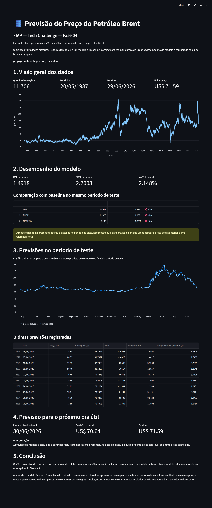

<h1 align="left">🛢️ FIAP Fase 04 — Brent Oil Forecast</h1>

<p align="left">
  
  
  
  
  
  
  
</p>

Aplicação preditiva para análise e previsão do preço do petróleo Brent em dólar, desenvolvida como MVP para o Tech Challenge da Fase 04 da Pós-Tech FIAP em Data Analytics.

---

## ✅ Orientações para avaliação

Este repositório reúne os principais entregáveis do Tech Challenge FIAP — Fase 04.

O desafio propõe o seguinte cenário:

> Imagine que você foi escalado como cientista de dados em uma grande empresa de petróleo e precisa criar um modelo preditivo para garantir qual será a previsão do preço do petróleo em dólar e instanciar esse modelo preditivo em uma aplicação para auxiliar na tomada de decisão.

Para avaliação, recomenda-se acessar prioritariamente:

| Entregável | Caminho / Link | Observação |
|---|---|---|
| Aplicação Streamlit | <a href="https://fiap-fase04-oil-forecast.streamlit.app/" target="_blank" rel="noopener noreferrer">Abrir MVP online</a> | Aplicação visual publicada com o modelo preditivo |
| Notebook Python | [Abrir notebook](notebooks/analise_modelagem_petroleo_brent.ipynb) | Pipeline completa de análise, baseline, features, modelagem e avaliação |
| Aplicação principal | [Ver código do app](app.py) | Código da interface visual em Streamlit |
| Modelo treinado | [Ver modelo](models/modelo_petroleo.joblib) | Modelo Random Forest salvo com Joblib |
| Métricas do modelo | [Ver métricas](reports/metricas_modelo.json) | Métricas finais do modelo e comparação com baseline |
| Previsões do modelo | [Ver previsões](reports/previsoes_modelo.csv) | Previsões realizadas no período de teste |
| Base tratada | [Ver base tratada](data/processed/petroleo_brent_tratado.csv) | Base limpa utilizada na análise |
| Base com features | [Ver base com features](data/processed/petroleo_brent_features.csv) | Base final utilizada na modelagem |

---

## 🔗 Aplicação online

Acesse o MVP publicado no Streamlit:

<p align="left">
  <a href="https://fiap-fase04-oil-forecast.streamlit.app/" target="_blank" rel="noopener noreferrer">
    
  </a>
</p>

**Link direto:**  
<a href="https://fiap-fase04-oil-forecast.streamlit.app/" target="_blank" rel="noopener noreferrer">
https://fiap-fase04-oil-forecast.streamlit.app/
</a>

---

## 🖥️ Preview do aplicativo

<p align="left">
  <a href="https://fiap-fase04-oil-forecast.streamlit.app/" target="_blank" rel="noopener noreferrer">
    
  </a>
</p>

---

## 📌 Objetivo do projeto

O objetivo deste projeto é desenvolver uma solução de Data Analytics e Machine Learning capaz de:

- coletar dados históricos do preço do petróleo Brent;
- tratar e organizar a base para análise;
- explorar o comportamento histórico do preço;
- construir um baseline simples de comparação;
- criar features temporais;
- treinar um modelo preditivo;
- avaliar o desempenho do modelo;
- disponibilizar o modelo em uma aplicação Streamlit;
- apoiar a tomada de decisão em um contexto simulado de uma empresa do setor de petróleo.

---

## 🧠 Problema de negócio

Em uma grande empresa de petróleo, acompanhar a variação do preço do Brent é essencial para apoiar decisões estratégicas relacionadas a:

- planejamento financeiro;
- análise de risco;
- projeção de custos;
- acompanhamento de mercado;
- definição de estratégias operacionais;
- apoio à tomada de decisão executiva.

Neste projeto, atuando como cientista de dados, foi desenvolvido um MVP capaz de apresentar a evolução histórica do Brent, comparar um modelo preditivo com uma regra simples de referência e disponibilizar a previsão em uma interface visual.

A proposta não é oferecer uma recomendação financeira ou uma previsão oficial de mercado, mas demonstrar uma pipeline completa de ciência de dados aplicada a uma série temporal econômica.

---

## 🗂️ Base de dados

A base utilizada foi a série histórica do preço do petróleo Brent disponibilizada pelo IPEAData.

**Fonte:**  
http://www.ipeadata.gov.br/ExibeSerie.aspx?module=m&serid=1650971490&oper=view

A base contém registros históricos do preço do Brent em dólar ao longo do tempo.

Após o tratamento, a base final utilizada na análise contém:

| Indicador | Valor |
|---|---:|
| Quantidade de registros | 11.706 |
| Data inicial | 20/05/1987 |
| Data final | 29/06/2026 |
| Preço mínimo | US$ 9.10 |
| Preço máximo | US$ 143.95 |
| Preço médio | US$ 54.12 |
| Valores ausentes | 0 |

---

## 📊 Análise exploratória

A análise exploratória teve como objetivo entender o comportamento histórico do preço do petróleo Brent.

Foram observados:

- evolução histórica do preço;
- períodos de alta volatilidade;
- valores mínimos e máximos;
- tendência de longo prazo;
- comportamento recente da série;
- ausência de valores nulos após o tratamento.

A análise mostrou que o preço do petróleo Brent possui forte oscilação histórica, com períodos de crescimento acelerado, quedas bruscas e retomadas associadas a diferentes contextos econômicos, produtivos e geopolíticos.

---

## 🧪 Baseline

Antes de treinar um modelo de Machine Learning, foi construído um baseline simples.

A regra utilizada foi:

````text
preço previsto de hoje = preço de ontem
````

Esse baseline é importante porque serve como referência mínima de desempenho.

Em séries temporais financeiras e econômicas, o valor imediatamente anterior costuma ser uma referência forte. Por isso, qualquer modelo mais complexo precisa ser comparado com essa regra simples para verificar se realmente agrega valor.

### Métricas do baseline geral

| Métrica | Valor |
|---|---:|
| MAE | 0.9375 |
| RMSE | 1.5177 |
| MAPE | 1.7901% |

---

## 🧱 Engenharia de features

Foram criadas features temporais a partir do histórico do preço do Brent.

As principais variáveis utilizadas foram:

| Feature | Descrição |
|---|---|
| `lag_1` | preço do dia anterior |
| `lag_7` | preço de 7 períodos anteriores |
| `lag_30` | preço de 30 períodos anteriores |
| `media_7` | média móvel dos últimos 7 períodos |
| `media_30` | média móvel dos últimos 30 períodos |
| `variacao_1` | variação em relação ao período anterior |
| `variacao_7` | variação em relação a 7 períodos anteriores |
| `ano` | ano da observação |
| `mes` | mês da observação |
| `dia_da_semana` | dia da semana da observação |

As features foram construídas usando apenas informações disponíveis até o dia anterior, evitando vazamento de dados futuros.

---

## 🤖 Modelo preditivo

Foi treinado um modelo de regressão para prever o preço do petróleo Brent em dólar.

### Modelo utilizado

✅ **Random Forest Regressor**

O modelo foi escolhido por ser robusto, interpretar relações não lineares e funcionar bem como primeira solução de Machine Learning para um MVP.

A separação entre treino e teste respeitou a ordem temporal da série:

````text
Primeiros 80% dos dados → treino
Últimos 20% dos dados → teste
````

Essa abordagem evita embaralhamento temporal e simula melhor um cenário real de previsão.

---

## 📈 Métricas do modelo

### Período de treino

````text
1987-07-02 até 2017-09-10
````

### Período de teste

````text
2017-09-11 até 2026-06-29
````

### Resultado do modelo

| Métrica | Modelo Random Forest |
|---|---:|
| MAE | 1.4918 |
| RMSE | 2.2003 |
| MAPE | 2.1480% |

---

## ⚖️ Comparação com baseline

A comparação correta foi feita no mesmo período de teste do modelo.

| Métrica | Modelo Random Forest | Baseline no teste | Modelo melhor que baseline? |
|---|---:|---:|---|
| MAE | 1.4918 | 1.2732 | Não |
| RMSE | 2.2003 | 1.9691 | Não |
| MAPE | 2.1480% | 1.8398% | Não |

O modelo Random Forest foi treinado corretamente, mas não superou o baseline no período de teste.

Esse resultado é relevante, pois mostra que, para previsão diária do preço do Brent, repetir o preço do dia anterior é uma referência muito forte.

A conclusão reforça a importância de sempre comparar modelos de Machine Learning com baselines simples. Modelos mais complexos nem sempre superam regras simples, especialmente em séries temporais com forte dependência do valor mais recente.

---

## 🚀 MVP — Streamlit

Foi desenvolvido um MVP funcional utilizando Streamlit para disponibilizar a análise e o modelo preditivo em uma interface visual.

A aplicação apresenta:

- contexto do projeto;
- visão geral da base;
- gráfico histórico do preço do Brent;
- métricas do modelo;
- comparação entre modelo e baseline;
- gráfico de preço real vs preço previsto;
- tabela com as últimas previsões;
- previsão para o próximo dia útil;
- conclusão analítica.

O Streamlit foi utilizado por permitir a criação rápida de uma aplicação de dados, com visualização, tabelas, métricas e deploy em nuvem.

---

## 📓 Notebook principal

A pipeline completa do projeto está documentada no notebook:

````text
notebooks/analise_modelagem_petroleo_brent.ipynb
````

O notebook contempla:

- carregamento dos dados;
- análise da base tratada;
- análise exploratória;
- baseline;
- engenharia de features temporais;
- treinamento do modelo;
- avaliação do modelo;
- comparação com baseline;
- visualização das previsões;
- análise de erros;
- conclusão.

---

## 🛠️ Tecnologias utilizadas

- Python
- Pandas
- NumPy
- Scikit-Learn
- Streamlit
- Matplotlib
- Joblib
- Jupyter Notebook
- Git
- GitHub
- Streamlit Community Cloud

---

## 📂 Estrutura do projeto

````text
.
├── app.py
├── README.md
├── requirements.txt
├── fiap-fase04-oil-forecast.streamlit.app.png
├── baixar_dados.py
├── limpar_dados.py
├── analise_exploratoria.py
├── baseline.py
├── criar_features.py
├── treinar_modelo.py
│
├── data/
│   ├── raw/
│   │   └── petroleo_brent_bruto.csv
│   └── processed/
│       ├── petroleo_brent_tratado.csv
│       └── petroleo_brent_features.csv
│
├── models/
│   └── modelo_petroleo.joblib
│
├── notebooks/
│   ├── 01_pipeline_modelagem_petroleo.ipynb
│   └── analise_modelagem_petroleo_brent.ipynb
│
└── reports/
    ├── grafico_historico_petroleo_brent.png
    ├── baseline_comparacao.csv
    ├── baseline_metricas.json
    ├── features_resumo.json
    ├── previsoes_modelo.csv
    └── metricas_modelo.json
````

---

## ▶️ Como executar localmente

### 1️⃣ Clonar o repositório

````bash
git clone https://github.com/alexandreninja/fiap-fase04-oil-forecast.git
````

---

### 2️⃣ Acessar a pasta do projeto

````bash
cd fiap-fase04-oil-forecast
````

---

### 3️⃣ Criar ambiente virtual

````bash
python -m venv .venv
````

---

### 4️⃣ Ativar ambiente virtual

No Windows:

````bash
.venv\Scripts\activate
````

No Linux/Mac:

````bash
source .venv/bin/activate
````

---

### 5️⃣ Instalar dependências

````bash
pip install -r requirements.txt
````

---

### 6️⃣ Executar o Streamlit

````bash
streamlit run app.py
````

---

## 📦 Requirements

O projeto utiliza as principais bibliotecas para análise de dados, modelagem, visualização e deploy em Streamlit.

````txt
streamlit==1.58.0
pandas==3.0.3
numpy==2.5.1
scikit-learn==1.9.0
joblib==1.5.3
matplotlib==3.11.0
````

---

## 📤 Entrega para avaliação

A entrega do projeto contempla os dois itens solicitados:

| Exigência da avaliação | Onde encontrar |
|---|---|
| Link da aplicação do modelo preditivo no Streamlit | <a href="https://fiap-fase04-oil-forecast.streamlit.app/" target="_blank" rel="noopener noreferrer">https://fiap-fase04-oil-forecast.streamlit.app/</a> |
| Notebook Python com toda pipeline de construção do modelo | `notebooks/analise_modelagem_petroleo_brent.ipynb` |

Além disso, o repositório contém os scripts, dados tratados, modelo salvo e arquivos de métricas utilizados na aplicação.

---

## 📌 Observação metodológica

Este projeto possui finalidade acadêmica e analítica.

O modelo não deve ser interpretado como recomendação financeira, previsão oficial de mercado ou orientação de investimento.

O objetivo é demonstrar uma pipeline completa de ciência de dados aplicada a uma série temporal econômica, contemplando desde o tratamento dos dados até a disponibilização do modelo em uma aplicação web.

---

## 🧾 Conclusão

O MVP foi construído com sucesso, contemplando coleta, tratamento, análise, criação de features, treinamento de modelo, salvamento do modelo e disponibilização em uma aplicação Streamlit.

Apesar de o modelo Random Forest ter sido treinado corretamente, o baseline apresentou desempenho melhor no período de teste. Esse resultado é importante porque mostra que modelos mais complexos nem sempre superam regras simples.

Para uma evolução futura do projeto, recomenda-se:

- testar outros modelos de séries temporais;
- incluir variáveis externas, como câmbio, inflação, produção, consumo e eventos geopolíticos;
- avaliar horizontes de previsão maiores;
- automatizar a atualização da base;
- criar monitoramento de desempenho do modelo ao longo do tempo.

---

## 👨‍💻 Projeto acadêmico

Tech Challenge 04 — Pós-Tech FIAP Data Analytics  
2026

---


**Alexandre NINJA**  
Marketing Analytics → Ciência de Dados  
*Transformando dados em decisões — sem perder o propósito.*

<br clear="left">